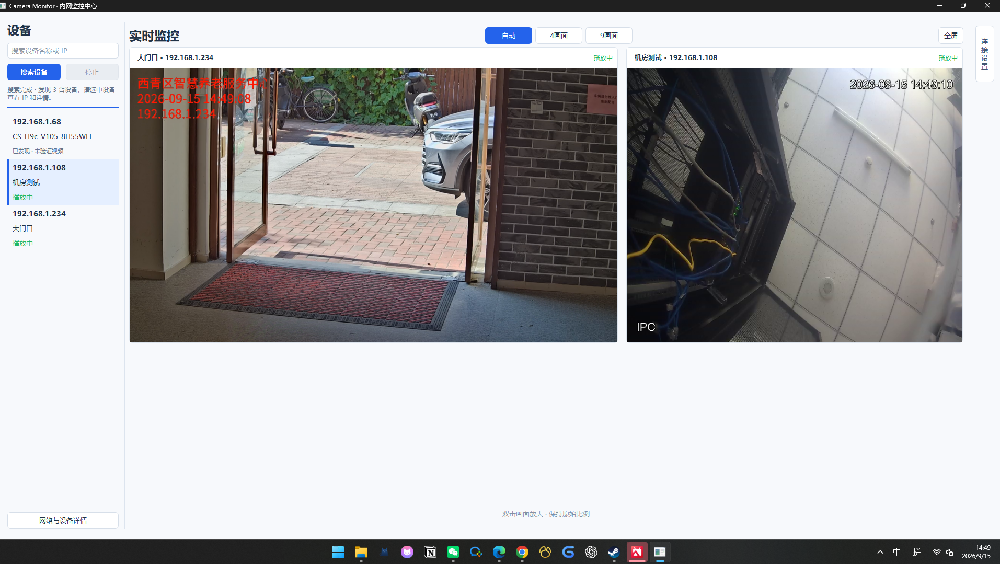

# Camera Monitor · 内网监控播放器

一个轻量的跨品牌 **RTSP 摄像头监控播放器**。自动发现局域网摄像头，在一个窗口里查看多个位置的实时画面。

## 界面预览



## 功能

- 自动搜索 ONVIF / 大华兼容设备，也可为已发现设备手动填写 RTSP 地址。
- 固定 4 / 6 / 9 / 10 / 12 / 15 / 16 / 20 / 25 格布局；不足的摄像头位置显示占位。4、9、12、16、20、25 格等分，6、10、15 格保留一大多小。
- 等分布局按钮全部直接显示在顶部；一大多小布局在下拉菜单选择。
- 搜索后获取设备缩略图，点击可查看最近预览大图；需已有账号密码，正在播放的设备优先复用现有画面。
- 全屏退出需密码（初始 `000000`），通过“大屏密码”修改或验证当前密码后恢复初始密码。全屏只允许放大/还原、拖拽排序；这是应用内锁，不阻止操作系统强制结束进程。
- 视频区域保持 16:9，原始画面完整拉伸至该比例、不裁切；屏幕比例不匹配时外围留空。
- 拖动交换画面与主位并记住顺序，单击放大、再次单击返回。全屏显示画面和叠加名称，可设置顶部机构名称，按 Esc 返回。
- 全屏名称可设置四角位置和预置颜色；支持勾选多台设备批量设置连接账号密码。
- 自定义摄像头名称，账号密码保存在系统安全存储中。
- TCP / UDP 传输可选，断线后每次等待 3 秒自动重连。

当前支持 RTSP 视频预览，**暂不支持 RTMP、音频和录像**。自动发现需要设备支持并开启相应协议。

## 下载

| 系统 | 下载 | 使用方式 |
| --- | --- | --- |
| Windows 11 · 64 位 Intel / AMD | [下载 Windows 版](https://github.com/rooma1989/CameraMonitor/releases/latest/download/CameraMonitor-Windows11-x64.zip) | 解压后运行 `CameraMonitor.exe` |
| macOS 14+ · Apple 芯片 M 系列 | [下载 Mac 版](https://github.com/rooma1989/CameraMonitor/releases/latest/download/CameraMonitor-macOS-AppleSilicon.zip) | 解压后将 `Camera Monitor.app` 拖入“应用程序” |

两个版本均无需安装 Python。[查看全部版本](https://github.com/rooma1989/CameraMonitor/releases)。

首次运行请允许局域网访问；Windows 防火墙请选择信任的专用网络。Mac 版尚未经过 Apple 公证，如被系统拦截，确认下载来源后按 [Apple 官方说明](https://support.apple.com/zh-cn/102445)在“系统设置 → 隐私与安全性”中允许打开。

## 快速使用

1. 电脑与摄像头连接同一局域网，点击“搜索设备”。
2. 双击设备，按需输入账号密码；可在设置里保存位置名称。
3. 左下方“批量账号密码”可统一设置所选设备；已播放设备下次手动连接使用新凭据。
4. 顶部选择固定格子布局，拖动画面调整主位，F11 进入全屏、Esc 返回。名称颜色和位置在各摄像头设置中调整；点击“机构名称”设置全屏顶部文字，留空可隐藏。
5. 若频繁断流，停止后切换到“UDP（兼容模式）”再连接。

## 支持项目

如果觉得好用，欢迎点个 Star ⭐，也可以请我喝杯咖啡 ☕️


## 从源码运行

```sh
python3 -m venv .venv
# 激活虚拟环境后执行：
python -m pip install -r requirements.txt
python -m camera_monitor.app
```

打包说明：[Windows](packaging/Windows使用说明.md) · [macOS](packaging/macOS使用说明.md)。
