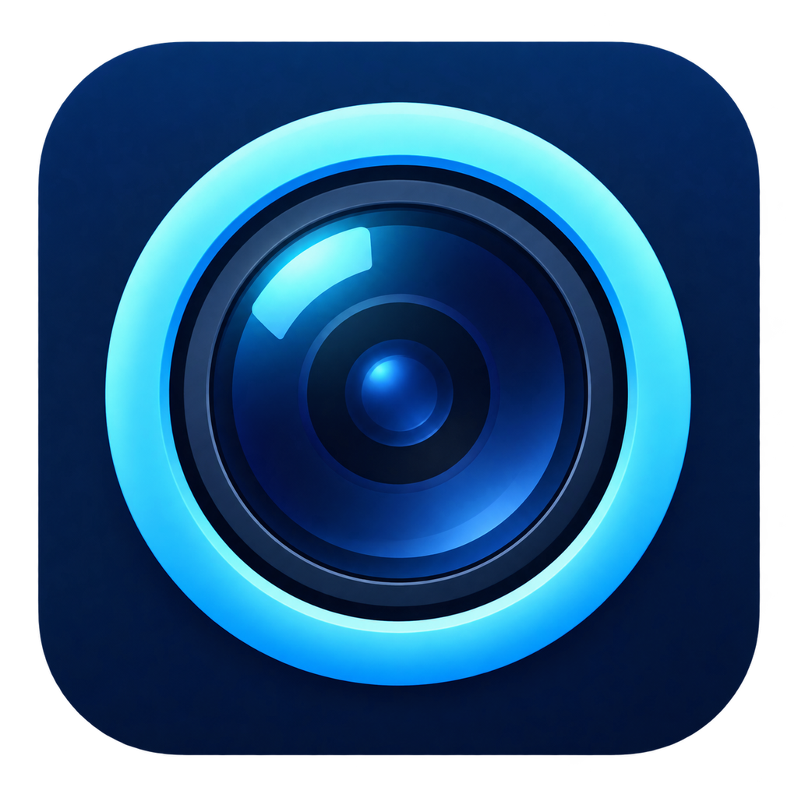
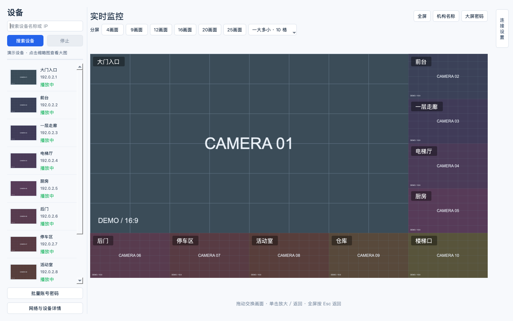
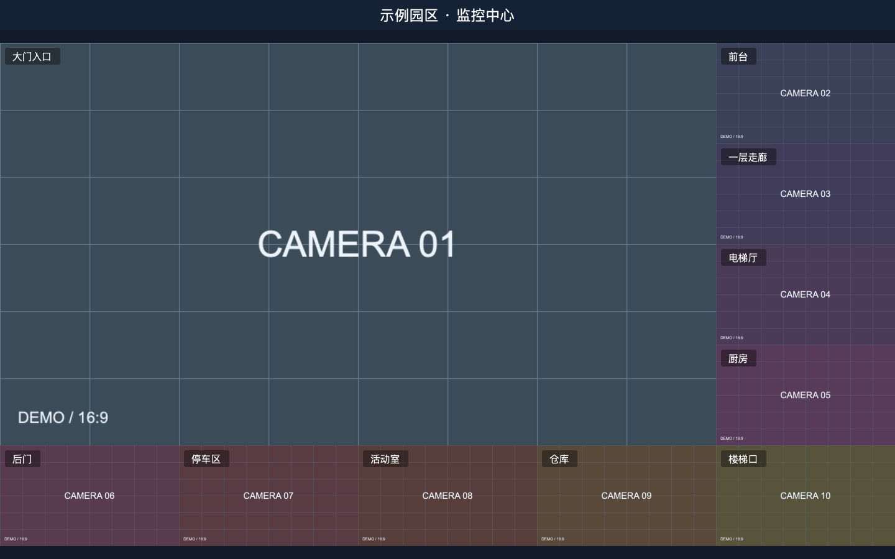
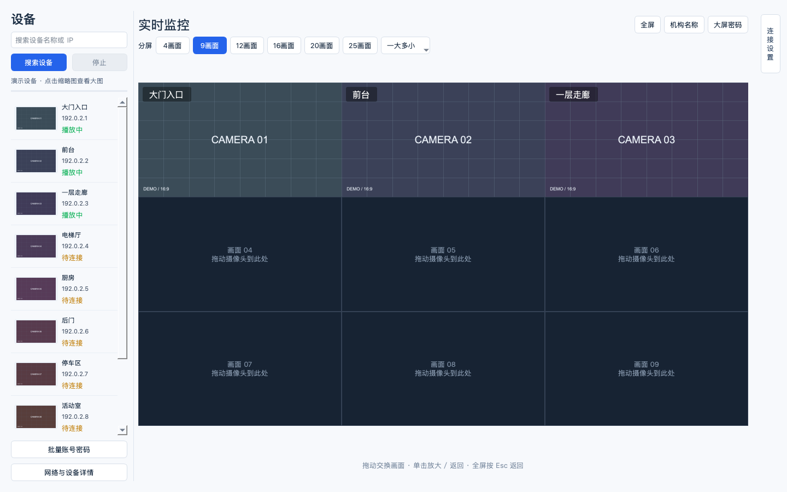
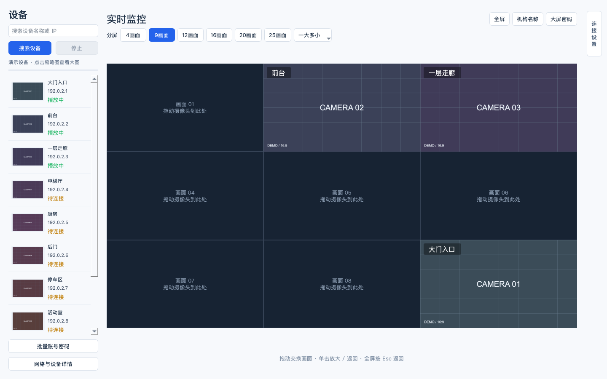
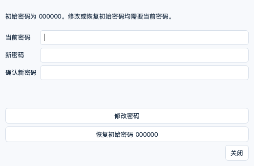

<p align="center">
  
</p>

# Camera Monitor · 内网监控播放器

轻量的跨品牌 **RTSP 摄像头监控软件**，自动发现局域网设备，在一个窗口中查看多个位置的实时画面。支持 Windows 11 64 位和 Apple M 系列 Mac。

## 下载

| 系统 | 下载最新版 | 使用方式 |
| --- | --- | --- |
| Windows 11 · Intel / AMD 64 位 | [下载 Windows 版](https://github.com/rooma1989/CameraMonitor/releases/latest/download/CameraMonitor-Windows11-x64.zip) | 解压后运行 `CameraMonitor.exe` |
| macOS 14+ · Apple M 系列 | [下载 Mac 版](https://github.com/rooma1989/CameraMonitor/releases/latest/download/CameraMonitor-macOS-AppleSilicon.zip) | 解压后将 `Camera Monitor.app` 拖入“应用程序” |

无需安装 Python。[全部版本与更新记录](https://github.com/rooma1989/CameraMonitor/releases) · [Windows 使用说明](packaging/Windows使用说明.md) · [Mac 使用说明](packaging/macOS使用说明.md)

## 主要功能

- **自动发现与预览**：搜索 ONVIF / 大华兼容设备，左侧紧凑列表显示缩略图、名称和 IP，点击缩略图查看大图。
- **每行数量**：等分布局可在顶部分别设置每行几个画面，自动保存；12 格默认 3 列 × 4 行，20 格默认 4 列 × 5 行。每格保持 16:9，窗口比例不匹配时保留外侧留白。
- **固定分屏**：4、9、12、16、20、25 格等分，6、10、15 格一大多小；设备不足时保留空位。10 格环绕布局横竖各 5 格，共用右下角，周边小画面尺寸一致。
- **自由调整位置**：摄像头之间、摄像头与空位之间可拖拽换位并保存位置；单击画面放大，再次单击还原。
- **大屏展示**：视频区域保持 16:9，可设置机构名称、摄像头名称的颜色和四角位置。全屏隐藏侧栏与操作按钮。
- **全屏密码锁**：退出全屏需验证密码，初始密码为 `000000`；支持修改，以及验证当前密码后恢复初始密码。
- **连接管理**：支持批量设置账号密码、系统安全存储、TCP / UDP 传输和固定等待 3 秒自动重连。

当前支持 **RTSP 视频预览**，暂不支持 RTMP、音频和录像。自动发现需要摄像头开启兼容协议；也可在已发现设备的连接设置中手动填写 RTSP 地址。

## 界面预览

以下截图来自 **v0.7.0 实际软件界面**，视频区域使用模拟画面展示布局，不代表真实摄像头的画质或并发性能。

### 紧凑设备列表与监控工作台

缩略图、名称和 IP 横排展示，等分按钮直接显示在顶部。



### 10 格环绕大屏

一个主画面与九个等尺寸小画面；顶部展示机构名称，摄像头名称叠加在画面上。



### 固定分屏与空位

选择 9 格就是 3×3；只有 3 台摄像头时，其余 6 格保留占位。



### 拖到空位，调整监控顺序

将“大门入口”移到右下角后，原来的左上角变为空位，播放对象保持不变。



### 大屏密码设置

修改密码和恢复初始密码都需要验证当前密码。



## 快速使用

1. 电脑与摄像头连接同一局域网，点击 **搜索设备**。
2. 双击设备，按需输入账号密码；连接设置中可保存位置名称。已有凭据时自动尝试获取缩略图，正在播放的设备优先复用现有画面。
3. 左下方 **批量账号密码** 可统一配置所选设备；已经播放的设备在下次手动连接时使用新凭据。
4. 顶部选择分屏数量。拖动画面到另一画面或空位即可换位，单击画面放大／还原。
5. 点击 **机构名称** 设置全屏顶部文字；在各摄像头设置中调整名称颜色和位置。
6. 通过 **大屏密码** 修改初始密码。按 **F11** 进入全屏；按 Esc、F11 或尝试关闭窗口时，输入正确密码才能退出全屏。全屏中仍可放大／还原、拖拽排序。

## 常见问题

- **搜不到设备？** 请确认处于同一局域网，摄像头已开启 ONVIF / 兼容发现协议，并允许软件访问局域网。Windows 防火墙请选择信任的专用网络。
- **缩略图显示“需登录”？** 先在连接设置中输入正确凭据并播放；没有账号密码时不会自动尝试登录。放大的缩略图是最近获取的一帧，并非实时视频。
- **画面外围有留空？** 所有视频区域按 16:9 排布，源画面完整拉伸至该比例、不裁切；屏幕比例不匹配时，留空集中在监控墙外围。
- **频繁断流？** 可停止播放后尝试“UDP（兼容模式）”。网络、设备兼容性和码率也会影响稳定性。
- **密码存在哪里？** 摄像头凭据保存在当前系统用户的安全存储中，不会随安装包转移到另一台电脑。大屏锁属于应用内控制，不能阻止操作系统强制结束程序。
- **Mac 首次打开被拦截？** 本版尚未经过 Apple 公证。确认下载来源后，按 [Apple 官方说明](https://support.apple.com/zh-cn/102445)在“系统设置 → 隐私与安全性”中允许打开。

## 支持项目

如果觉得好用，欢迎点个 Star ⭐，也可以请我喝杯咖啡 ☕️


## 从源码运行

```sh
python3 -m venv .venv
# 激活虚拟环境后执行：
python -m pip install -r requirements.txt
python -m camera_monitor.app
```

支持在 Windows / Apple 芯片 Mac 本地打包，也可使用仓库中的 GitHub Actions 云端构建。详见 [Windows 打包说明](packaging/Windows使用说明.md)与 [macOS 打包说明](packaging/macOS使用说明.md)。
